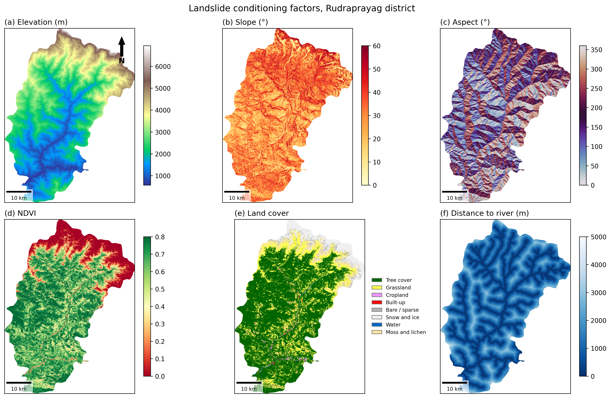
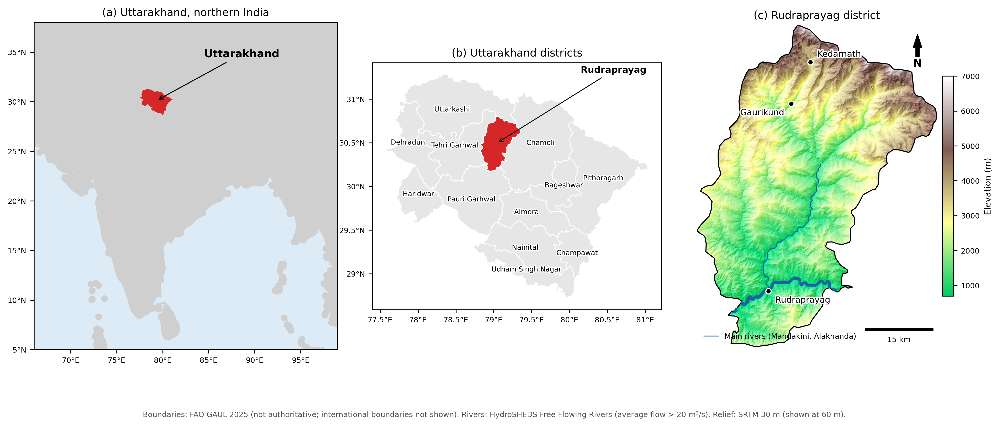
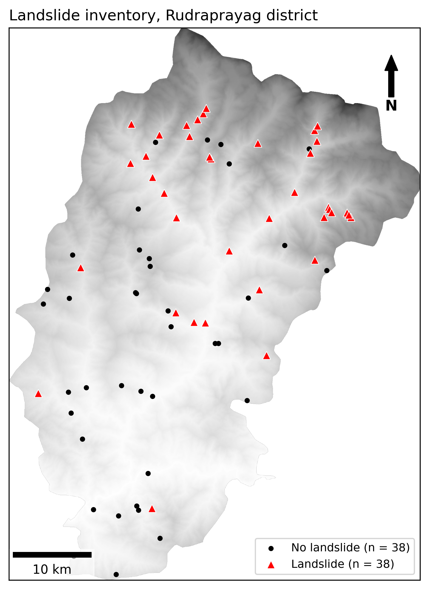
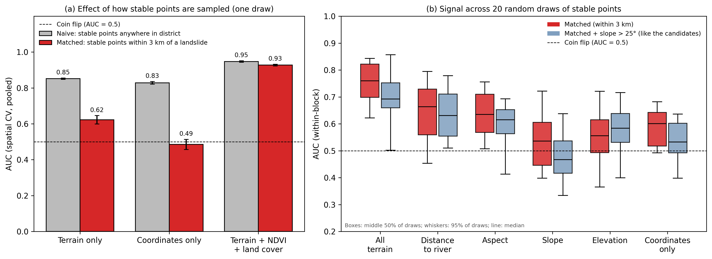
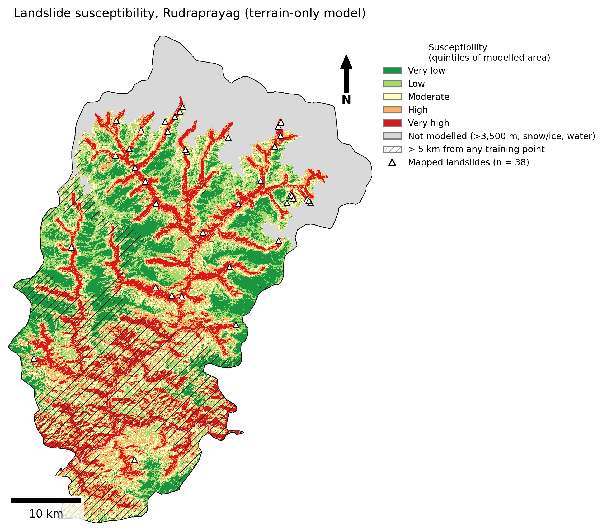
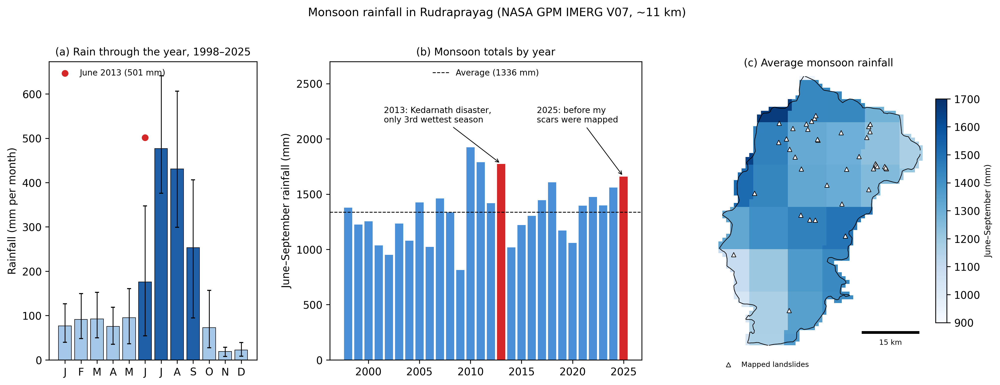

# Landslide Risk Mapping in Uttarakhand 🏔️

> 🚧 **In progress.** Built in the open.

Every monsoon, landslides in Uttarakhand block highways, cut off villages and cost lives.
This project uses **free satellite data and machine learning** to map *where* slopes are
most likely to fail in **Rudraprayag district**, and *when* heavy rainfall pushes that risk up.

🗺️ **[Explore the interactive map →](https://makkergauri.github.io/uttarakhand-landslide-risk/)**
Zoom in, switch layers, and click any landslide to check it on satellite imagery yourself.

## Why this matters

Rudraprayag sits on the route to Kedarnath, one of the busiest pilgrimage roads in India,
in terrain that is steep, young and heavily cut by rivers and road construction.
Knowing which slopes are most vulnerable helps decide where to monitor, reinforce, or warn.

## Figure 1: Study area

Rudraprayag is one of Uttarakhand's 13 districts, in the Garhwal Himalaya. It rises from about 700 m
in the southern valleys to about 7,000 m in the north, and is drained by the **Mandakini**, which flows
south from the Kedarnath area, and the **Alaknanda**; the two meet at Rudraprayag town.
Boundaries are from FAO GAUL 2025 and are not authoritative; international boundaries are not shown.

## Approach

1. **Features:** for every 30 m pixel, compute factors that influence slope stability:
   elevation, slope, aspect, vegetation (NDVI), land cover, and distance to rivers.
2. **Landslide inventory:** existing inventories (GSI Bhukosh, NASA COOLR) weren't accessible,
   so I built my own with a **semi-automatic method**:
   - the code finds bare patches on steep slopes (possible landslide scars) from Sentinel-2 imagery,
   - I review each candidate on high-resolution imagery with a custom Earth Engine tool
     and label it landslide / not a landslide / unsure.
3. **Model:** a random forest learns which combinations of terrain factors are associated with landslides.
4. **Honest evaluation:** spatial cross-validation (training and testing on *separate areas*),
   plus checks that the model isn't just learning *where* landslides happen to be in my data.
5. **Rainfall:** satellite rainfall (NASA GPM IMERG) to see *when* and *where* the monsoon hits hardest.
6. **Map:** an interactive susceptibility map anyone can explore.

## Figure 3: Landslide inventory

No usable landslide inventory was reachable for Rudraprayag, so I built a preliminary one:

- **Candidates:** Sentinel-2 (Oct–Dec 2025) pixels with NDVI < 0.2, slope > 25°, below 3,500 m,
  not snow/ice or water, grouped into patches of 0.2–20 ha → **330 candidate patches**.
- **Manual review:** 300 randomly sampled candidates checked one by one on high-resolution
  satellite imagery → **42 landslides, 190 not landslides, 68 unsure**.
- **Deduplication:** landslide points within 200 m of each other merged → **38 landslides**.
- **No-landslide points:** 38 random points in the same terrain (below 3,500 m, not snow/water),
  at least 500 m from any landslide.

Grey shading shows elevation (darker = higher).

**Limitations:** small inventory from a single interpreter, no field verification, and only
landslides still bare in late 2025 and larger than 0.2 ha could be found. Landslides cluster
in the north (upper Mandakini valley), which turned out to matter a lot for the model (below).

## Figure 4: Model evaluation

**The first model looked great, and then fell apart for the right reasons.**

- With no-landslide points spread across the whole district, a terrain-only random forest scored
  **AUC 0.85** under spatial cross-validation. But a model that only knew each point's **map coordinates**
  scored **0.83**. Because landslides cluster in the north, the model was mostly learning *where*,
  not *why*.
- **Fix:** I re-drew the no-landslide points **within 3 km of each landslide** (same valleys, > 500 m
  from any landslide). Now location gives no advantage: the coordinates-only model drops to ~0.49,
  a coin flip.
- On this matched set, the terrain-only model scores **AUC ≈ 0.72** when tested inside held-out areas
  (within-block AUC, ± 0.05 across 10 repeats; the true uncertainty is larger with only 76 points).
  That's the honest number: *within the same area*, it ranks the landslide above its stable neighbour
  about 72% of the time.
- **Slope** and **distance to river** carry the local signal (~0.66 each on their own); elevation is weak
  and aspect adds nothing.
- Adding **NDVI and land cover** pushes the score to ~0.93–0.95, but only because the landslides were
  *found* by looking for bare ground. These features describe the scar, not the slope before it failed,
  so they're excluded from the model.

**Caveats:** the slope signal may be partly inflated because candidates had to be steeper than 25°,
and distance to river may partly stand for distance to roads, which follow the rivers here.
Published studies often report AUCs of 0.85–0.95, but with different sampling and validation,
so the numbers aren't directly comparable.

## Figure 5: Susceptibility map

The final terrain-only model scores every 30 m pixel below 3,500 m (about 1,590 km²).
Scores are **relative**, not probabilities, so the map uses five classes that each cover
20% of the modelled area.

- **Pattern:** the highest classes follow the river network, especially the valley walls of the
  Mandakini, the Alaknanda and their tributaries; ridges score low.
- **Held-out check:** for each of 5 areas, I trained the model without that area and checked where
  its landslides fell. **87% of held-out landslides** landed in High/Very high (chance: 40%).
  But so did **66% of nearby stable slopes**. So the map is good at finding *hazardous valley sides*,
  and only partly separates the slope that fails from its neighbour. With 38 points per group,
  this gap is suggestive, not conclusive.
- **Hatched areas** are more than 5 km from any training point (38% of the modelled area, mostly
  the south). The model is extrapolating there, and the speckled pattern in the south is likely
  an artefact of that.

> ⚠️ **This is a student research project, not an official hazard map.** It is based on a small,
> unverified inventory and should not be used for safety or planning decisions.
> For official information, refer to the Uttarakhand State Disaster Management Authority.

## Figure 6: Monsoon rainfall

Satellite rainfall (NASA GPM IMERG V07, monthly, ~11 km pixels, 1998–2025) over the district:

- **The monsoon dominates:** June–September brings about **1,336 mm**, roughly **72%** of the annual
  total (~1,865 mm), peaking in July and August.
- **June 2013 stands out:** at **501 mm** it's the wettest June in the record, almost three times the
  average June, matching the rainfall behind the Kedarnath disaster in this district.
- **But 2013 was only the 3rd wettest monsoon overall.** The disaster came from a short, extreme burst,
  not an unusually wet season, so seasonal totals alone can't tell you when slopes fail.
- **My scars were mapped after three above-average monsoons:** 2023 (+5%), 2024 (+17%) and
  2025 (+24%, 4th wettest). That's *consistent with* many fresh scars, but the inventory has no dates,
  so it can't show which monsoon triggered which landslide.
- **Where:** the northwest is wettest (~1,600+ mm per monsoon), the southwest driest (~940 mm).
- **Rain and susceptibility are independent at this scale:** exactly 33% of the "Very high" area falls
  in the wettest third of the district, the value you'd expect with no relationship. So terrain and
  rainfall carry separate information, and a slope's overall hazard depends on both.

**Why rainfall isn't in the model:** each IMERG pixel is ~11 km wide, and 26 of 38 landslides share
exactly the same rainfall value as their nearest stable point. At this resolution, rainfall can't
tell a failing slope from its neighbour. Satellite rainfall in steep mountains is also uncertain;
the June 2013 check is reassuring, but it isn't a validation against rain gauges.

## Roadmap

- [x] Step 1: Build feature stack in Google Earth Engine (`01_build_features.ipynb`)
- [x] Figure 2: conditioning factors
- [x] Step 2: Landslide inventory: 300 candidates reviewed, 38 landslides after deduplication (`02_landslide_inventory.ipynb`)
- [x] Figure 3: landslide inventory map
- [x] Step 3: Random forest, spatial cross-validation, naive vs matched sampling (`03_model.ipynb`)
- [x] Figure 4: model evaluation
- [x] Figure 5: susceptibility map across the district, with held-out check
- [x] Step 4: Monsoon rainfall with NASA GPM IMERG (`04_rainfall.ipynb`)
- [x] Figure 6: rainfall seasonality, monsoon totals, spatial pattern
- [x] Step 5: Interactive map on GitHub Pages (`05_interactive_map.ipynb`, [live map](https://makkergauri.github.io/uttarakhand-landslide-risk/))
- [x] Figure 1: study area map (`06_study_area.ipynb`)
- [ ] Step 6: Technical write-up and comparison with published studies ← **next**

## Data sources

| Factor | Dataset |
|---|---|
| Elevation, slope, aspect | NASA SRTM 30 m |
| Vegetation (NDVI) | Copernicus Sentinel-2 |
| Land cover | ESA WorldCover 10 m |
| Rivers | WWF HydroSHEDS |
| District boundary | FAO GAUL 2025 |
| Landslide inventory | My own, from Sentinel-2 candidates verified on high-resolution imagery |
| Rainfall | NASA GPM IMERG V07 monthly (~11 km), 1998–2025 |

## Repository structure

| File | What it does |
|---|---|
| `01_build_features.ipynb` | Builds the 6 conditioning factors in Earth Engine and makes Figure 2 |
| `02_landslide_inventory.ipynb` | Removes duplicate landslides, samples no-landslide points, makes Figure 3 |
| `03_model.ipynb` | Random forest with random vs spatial CV, naive vs matched sampling, feature diagnostics, susceptibility map, held-out check, Figures 4–5 |
| `04_rainfall.ipynb` | Monthly IMERG rainfall, monsoon totals by year, rainfall map, rainfall vs susceptibility, Figure 6 |
| `05_interactive_map.ipynb` | Converts the susceptibility map into web layers and builds the interactive Folium map |
| `06_study_area.ipynb` | Study area map: South Asia locator, Uttarakhand districts, Rudraprayag relief, rivers and places (Figure 1) |
| `docs/index.html` | The interactive map itself (served by GitHub Pages) |
| `data/training_points_wgs84.geojson` | 76 training points, naive sampling (label 1 = landslide, 0 = no landslide), lat/lon (EPSG:4326) |
| `data/training_points_matched_wgs84.geojson` | 76 training points, matched sampling (stable points within 3 km of a landslide), lat/lon (EPSG:4326) |
| `data/landslide_review_rudraprayag.geojson` | All 299 saved review decisions (yes / no / unsure) with candidate ID and patch area |
| `data/rainfall_monthly_rudraprayag.csv` | District-average monthly rainfall, 1998-01 to 2025-09 (mm) |
| `data/rainfall_monsoon_totals.csv` | June–September rainfall totals per year, 1998–2025 (mm and % vs average) |
| `figures/` | Figures for the paper |
| `notes.md` | Running log of every decision, problem and fix |
| `requirements.txt` | Python packages used by the notebooks |

## Run it

1. Get a free [Google Earth Engine](https://earthengine.google.com/) account (noncommercial use).
2. Open `01_build_features.ipynb` and click the **Open in Colab** button.
3. Replace the project ID in the first cell with your own Earth Engine project.
4. For `02_landslide_inventory.ipynb`: put `rudraprayag_features.tif` (from notebook 01) and
   `data/landslide_review_rudraprayag.geojson` in a Google Drive folder called `landslide_project/`,
   then run the notebook in Colab.
5. For `03_model.ipynb`: same Drive folder, plus `training_points.geojson` from notebook 02
   (or `data/training_points_wgs84.geojson` renamed; the notebook reprojects it automatically).
6. For `04_rainfall.ipynb`: same Drive folder and Earth Engine project; it also needs
   `rudraprayag_susceptibility.tif` and `training_points_matched.geojson` from notebook 03.
7. For `05_interactive_map.ipynb`: same Drive folder and Earth Engine project (for the district boundary);
   it needs `rudraprayag_susceptibility.tif` and `training_points_matched.geojson` from notebook 03.
8. For `06_study_area.ipynb`: same Drive folder and Earth Engine project; it needs `rudraprayag_features.tif` from notebook 01.

## Data citations

- Farr, T. G. et al. (2007). The Shuttle Radar Topography Mission. *Reviews of Geophysics*, 45.
- Contains modified Copernicus Sentinel data (2024–2025), processed by ESA.
- Zanaga, D. et al. (2022). ESA WorldCover 10 m 2021 v200. doi:10.5281/zenodo.7254221
- Grill, G. et al. (2019). Mapping the world's free-flowing rivers. *Nature*, 569, 215–221.
- FAO (2025). Global Administrative Unit Layers (GAUL) 2025. CC-BY-4.0.
- Rouse, J. W. et al. (1974). Monitoring vegetation systems in the Great Plains with ERTS (NDVI).
- Huffman, G. J., Stocker, E. F., Bolvin, D. T., Nelkin, E. J., Tan, J. (2019). GPM IMERG Final Precipitation L3 1 month 0.1° × 0.1° V07. GES DISC. doi:10.5067/GPM/IMERG/3B-MONTH/07
- Basemaps in the interactive map: Esri World Imagery; © OpenStreetMap contributors; OpenTopoMap (CC-BY-SA).

